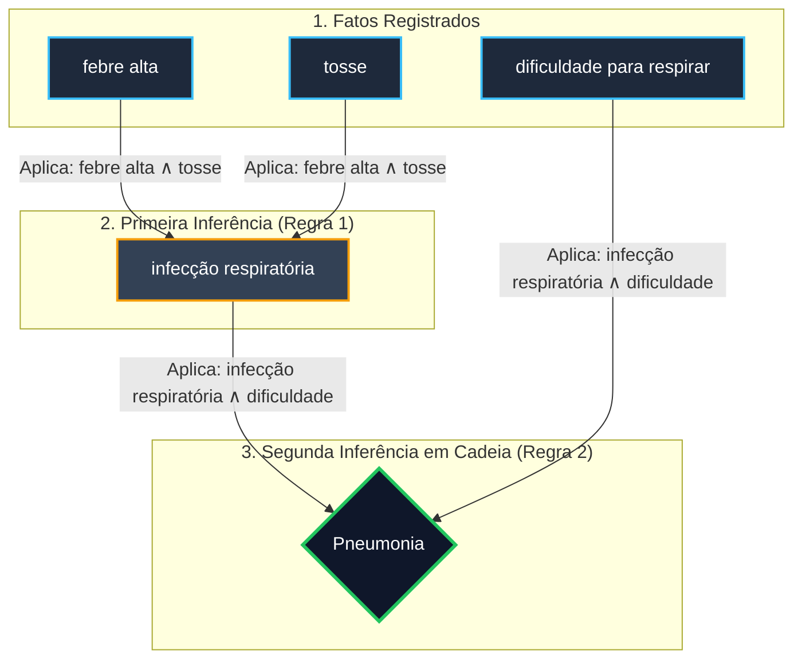

<div align="center">

# 🧠 Propositional Expert System (PyInference Engine)

  <p align="center">
    <strong>Motor de Inferência Lógica e Sistema Especialista Baseado em Regras em Python</strong>
  </p>

  <!-- BADGES / SHIELDS -->
  <p align="center">
    
    
    
    
  </p>

</div>

---

> [!NOTE]
> **Contexto do Projeto:**  
> Projeto desenvolvido durante o programa **Tech Builder**, focado na implementação prática de **Sistemas Baseados em Conhecimento**, **Lógica Proposicional** e **Encadeamento para Frente (Forward Chaining)** para tomada de decisão e diagnóstico automatizado.

---

## 📖 Visão Geral e Problema de Negócio

Sistemas Especialistas são uma das vertentes clássicas da Inteligência Artificial Simbólica. Diferente de modelos que aprendem por estatística, estes sistemas tomam decisões determinísticas e explicáveis utilizando **fatos** e **regras de inferência** mapeados de um domínio do conhecimento humano.

Este projeto implementa um **Motor de Inferência Reutilizável em Python** composto por:
* **`BaseDeConhecimento`:** Armazena fatos observados e regras de produção no formato $(P \land Q) \rightarrow R$.
* **`SistemaEspecialista`:** Executa o algoritmo de **Forward Chaining** para derivar novos fatos em cadeia de forma automatizada.

---

## 🔄 Fluxo de Raciocínio (Forward Chaining)

O diagrama abaixo ilustra como o motor de inferência consome os fatos iniciais relatados (sintomas) e aplica as regras sequencialmente até deduzir conclusões mais complexas:



---

## ⚙️ Arquitetura e Funcionamento do Código

A solução segue o princípio da **separação entre conhecimento e mecanismo de busca**, garantindo alta modularidade:

### 1. Separação de Responsabilidades
* **Base de Conhecimento (`BaseDeConhecimento`):** Funciona como um repositório dinâmico. Ela desconhece como os dados serão processados; apenas garante a consistência das inserções.
* **Motor de Inferência (`SistemaEspecialista`):** É agnóstico ao domínio do problema. O mesmo código pode ser utilizado para diagnóstico médico, triagem de suporte de TI ou verificação de conformidade fiscal.

### 2. Algoritmo de Encadeamento para Frente
O método `inferir()` executa um laço iterativo $O(N \cdot R)$ aplicando a regra lógica do **Modus Ponens**:

$$\frac{P \rightarrow Q, \quad P}{Q}$$

```python
# Trecho principal do mecanismo de inferência
while novos_fatos:
    novos_fatos = False
    for condicao, conclusao in self.base_conhecimento.regras:
        # Verifica se TODOS os pré-requisitos lógicos estão presentes na base
        if all(fato in self.base_conhecimento.fatos for fato in condicao):
            if conclusao not in self.base_conhecimento.fatos:
                self.base_conhecimento.adicionar_fato(conclusao)
                novos_fatos = True  # Mantém o loop ativo para novas deduções
```

> [!TIP]
> **Explicação do Loop:**  
> Sempre que uma regra gera uma nova conclusão, o sinalizador `novos_fatos` é redefinido para `True`. Isso obriga o sistema a reavaliar todas as regras na próxima rodada, permitindo que a nova conclusão sirva de gatilho para atuar em regras dependentes (efeito dominó).

---

## 📊 Estrutura de Regras de Exemplo (Diagnóstico Médico)

| Condições ($P \land Q$) | Conclusão Inferida ($R$) | Tipo |
| :--- | :--- | :---: |
| `febre alta` $\land$ `tosse` | `infecção respiratória` | Inferência Intermediária |
| `infecção respiratória` $\land$ `dificuldade para respirar` | `pneumonia` | Diagnóstico Final |

---

## 📁 Estrutura do Repositório

```text
Propositional-Expert-System/
├── index.py           # Implementação das classes BaseDeConhecimento e SistemaEspecialista
├── README.md          # Documentação detalhada do projeto
└── .gitignore         # Configurações do Git
```

---

## 🚀 Como Executar o Projeto

### Pré-requisitos
* Python 3.8+ (Sem necessidade de bibliotecas de terceiros).

### Passo a Passo

```bash
# 1. Clone o repositório
git clone [https://github.com/SEU_USUARIO/Propositional-Expert-System.git](https://github.com/SEU_USUARIO/Propositional-Expert-System.git)

# 2. Acesse a pasta do projeto
cd Propositional-Expert-System

# 3. Execute o script
python index.py
```

---

## 📈 Saída Esperada no Terminal

```text
==================================================
   SISTEMA ESPECIALISTA DE DIAGNÓSTICO MÉDICO    
==================================================

--- 1. Sintomas Relatados pelo Paciente ---
 • Sintoma registrado: febre alta
 • Sintoma registrado: tosse
 • Sintoma registrado: dificuldade para respirar

--- 2. Executando o Mecanismo de Inferência ---
 -> [DEDUÇÃO]: Como o paciente apresenta ['febre alta', 'tosse'], deduziu-se: 'infecção respiratória'.
 -> [DEDUÇÃO]: Como o paciente apresenta ['infecção respiratória', 'dificuldade para respirar'], deduziu-se: 'pneumonia'.

--- 3. Diagnóstico Final ---
Lista completa de fatos mantidos no prontuário do paciente:
 ✓ febre alta
 ✓ tosse
 ✓ dificuldade para respirar
 ✓ infecção respiratória
 ✓ pneumonia
```

---

<div align="center">
  <p>Desenvolvido por <strong>João Victor Sitta</strong> durante o programa <strong>Tech Builder</strong> 🚀</p>
</div>
